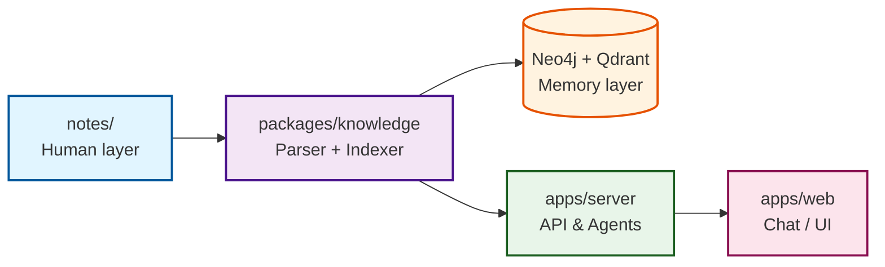

# 🧠 personal‑kg

> **darkhanakh’s self‑hosted personal AI stack** — builds and maintains your own knowledge graph, vector memory, and agentic layer to understand, recall, and act on everything about you.

---

## 🚀 Overview

**personal‑kg** is a TypeScript‑native, local‑first AI monorepo.  
It ingests your notes into a **graph + vector memory**, powers them with **LLMs**, and exposes an **API + UI** for querying and reflection.

This repo runs entirely on your machine for privacy and efficiency.  
The stack includes:

- **apps/web** → Next.js frontend (chat + dashboard)  
- **apps/server** → NestJS backend (API + retrieval)  
- **packages/knowledge** → NodeRAG ingestion + graph logic  
- **packages/configs** → ESLint / TS config shared by all packages  

---

## 🧩 Architecture



- **Graph DB:** Neo4j (entities, relationships)
- **Vector DB:** Qdrant (semantic memory)
- **LLM runtime:** Local (Ollama) or remote (GPT‑5)
- **Monorepo toolchain:** Turborepo + pnpm + TypeScript

---

## ⚙️ Setup

### 1. Clone & Install
```bash
git clone https://github.com/darkhanakh/personal-kg.git
cd personal-kg
pnpm install
```

### 2. Configure Environment
Create `.env` in project root:
```bash
NEO4J_URI=bolt://localhost:7687
NEO4J_USER=neo4j
NEO4J_PASS=password
QDRANT_URL=http://localhost:6333
OPENAI_API_KEY=           # optional if using remote model
NOTES_DIR=./private/notes
```

### 3. Start Databases
```bash
docker compose -f docker/docker-compose.yml up -d
```

### 4. Develop
```bash
# run everything (frontend + backend)
pnpm turbo dev
```

Individual scopes:
```bash
# backend only
pnpm turbo dev --filter=server

# frontend only
pnpm turbo dev --filter=web
```

---

## 🧠 Ingestion Flow

1. Add Markdown notes under `private/notes/`  
2. Run indexer script (coming soon) to parse, chunk, and embed  
3. View relationships in Neo4j Browser  
4. Query via the chat UI on `localhost:3000`

All personal data under `/private` is `.gitignored`  
— it stays **local and versioned privately**.

---

## 🐳 Docker Services

| Service | Port | Purpose |
|----------|------|---------|
| **neo4j** | 7474 / 7687 | Knowledge graph |
| **qdrant** | 6333 | Vector memory |
| **server** | 8000 | NestJS API |
| **web** | 3000 | Next.js UI |

---

## 🧾 Commands

| Task | Command |
|------|----------|
| Dev all | `pnpm turbo dev` |
| Build all | `pnpm turbo build` |
| Lint / format | `pnpm turbo lint` |
| Graph DB start | `docker compose up neo4j` |
| Vector DB start | `docker compose up qdrant` |

---

## 🧭 Roadmap

- [ ] Markdown → NodeRAG entity ingestion  
- [ ] Vector + Graph hybrid retrieval  
- [ ] Agentic reflection with LlamaIndex  
- [ ] Local LLM embedding via Ollama  
- [ ] Visualization / Search UI  

---

> “Your computer should remember you — not the other way around.”